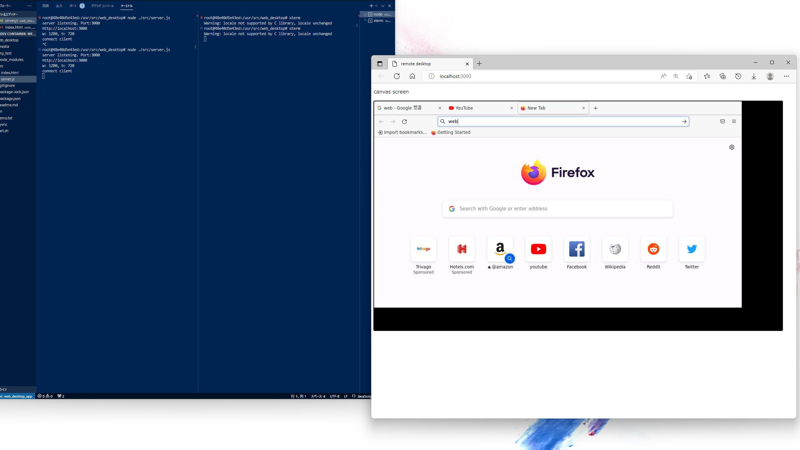

#### web_desktop
---
* webブラウザから操作できるリモートデスクトップソフト
* Docker上で開発


#### 構築（Docker上で動かす）
---
* docker_devリポジトリのweb_desktopブランチを使用してDocker構築: [docker_dev](https://github.com/Taukon/docker_dev.git)
```
$git clone https://github.com/Taukon/docker_dev.git
$cd docker_dev
$git checkout web_desktop_dev
$rm -rf .git
$mkdir src

$docker-compose build
$docker-compose up -d
```

* 作成したsrcディレクトリにweb_desktopをインストール
```
$cd src
$git clone https://github.com/Taukon/web_desktop.git
```

* Dockerのshell上からnpm installと実行
```
$cd /usr/src/web_desktop
$npm install
$node ./src/server.js
```
#### TODO
---
* キーボード入力の改善
* マウススクロール実装
* ブラウザからのコピー＆ペースト